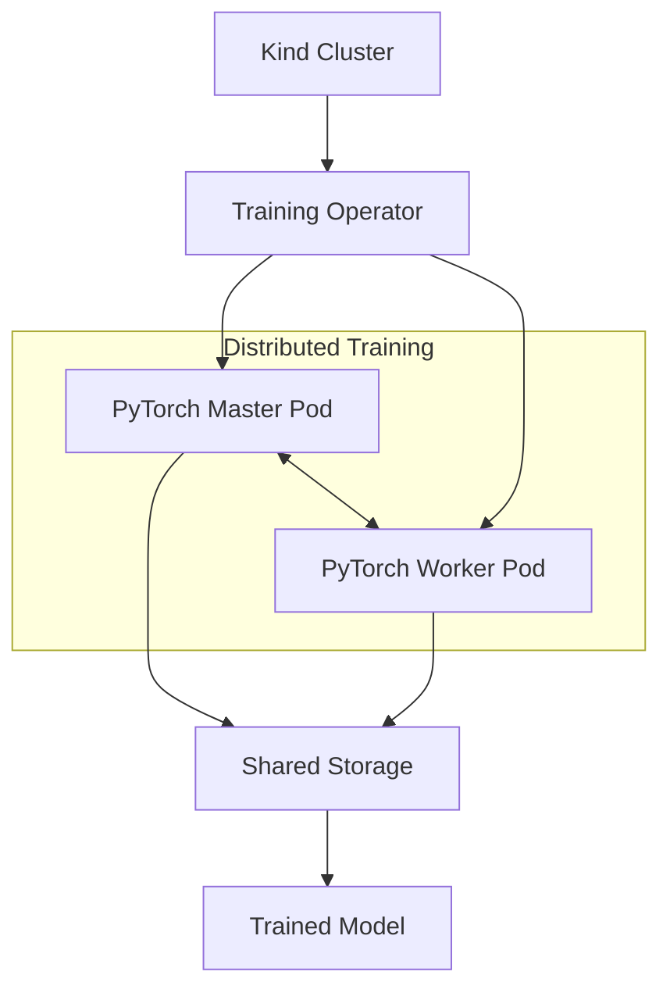

# 📚 Comprehensive Documentation & Examples

This directory contains detailed documentation, advanced examples, and troubleshooting guides for the distributed PyTorch training setup.

## 📋 Table of Contents

- [Setup Guide](#setup-guide)
- [Architecture](#architecture)
- [Resource Requirements](#resource-requirements)
- [Using Existing Clusters](#using-existing-clusters)
- [Linux-Specific Notes](#linux-specific-notes)
- [Automation Commands](#automation-commands)
- [Examples](#examples)
- [Customization](#customization)
- [Troubleshooting](#troubleshooting)

## 🚀 Setup Guide

### Detailed Prerequisites

**macOS Systems:**
- **macOS 11+** (Big Sur or newer)
- **8GB+ RAM** (16GB recommended for M1/M2 Macs)  
- **4+ CPU cores**, **10GB free disk space**
- **Docker Desktop** or **Podman**

**Linux Systems:**
- **Distribution**: Fedora 38+, Ubuntu 20.04+, Debian 11+, CentOS 8+, RHEL 8+, Arch Linux
- **Memory**: 8GB minimum, 16GB recommended
- **CPU**: 4+ cores (Intel x86_64 or ARM64)
- **Storage**: 10GB free disk space minimum, 20GB recommended
- **Container Runtime**: Docker or Podman (auto-installed by setup script)
- **Python**: 3.8+ (auto-installed if missing)

**Network Requirements:**
- Internet connection for downloading container images and datasets
- Kubernetes API server access (localhost:8080 or custom kubeconfig)

### Installation Options

**Option A: Automated Installation (Recommended)**
```bash
# Clone the repository first
git clone https://github.com/<your-username>/distributed-pytorch-training-setup.git
cd distributed-pytorch-training-setup

# Complete setup (includes dependency installation)
make setup

# This will install:
# - Docker/Podman (container runtime)
# - Python 3.8+ with pip
# - kubectl (Kubernetes CLI)
# - kind (Kubernetes in Docker)
# - PyTorch and dependencies
```

**Option B: Manual Installation**
```bash
# macOS with Homebrew
brew install kind kubectl docker

# Fedora/RHEL/CentOS
sudo dnf install -y docker kubectl
# For kind:
curl -Lo ./kind https://kind.sigs.k8s.io/dl/v0.20.0/kind-linux-amd64
chmod +x ./kind && sudo mv ./kind /usr/local/bin/kind

# Ubuntu/Debian
sudo apt-get update
sudo apt-get install -y docker.io kubectl
# For kind:
curl -Lo ./kind https://kind.sigs.k8s.io/dl/v0.20.0/kind-linux-amd64
chmod +x ./kind && sudo mv ./kind /usr/local/bin/kind

# Arch Linux
sudo pacman -S docker kubectl
# For kind:
curl -Lo ./kind https://kind.sigs.k8s.io/dl/v0.20.0/kind-linux-amd64
chmod +x ./kind && sudo mv ./kind /usr/local/bin/kind
```

### Setup Options

**Option A: Full automated setup (recommended)**
```bash
make setup                    # Complete setup: cluster + dependencies + training environment
# This will:
# - Check system requirements and install dependencies
# - Create new Kind cluster (or detect existing)
# - Install Kubeflow training operator
# - Download MNIST dataset and create ConfigMap
# - Validate complete setup
```

**Option B: Use existing cluster (EKS, GKE, AKS, minikube, etc.)**
```bash
make use-existing             # Use existing cluster + complete training setup
# This will:
# - Detect and validate existing cluster
# - Install training operator on existing cluster
# - Download dataset and prepare ConfigMap
```

**Option C: Modular setup (for advanced users)**
```bash
make verify-system            # Check system requirements and dependencies
make install-operator         # Install training operator only
# Note: Use 'make setup' for complete automated setup
```

## 🔧 Architecture



**Key Components:**
- **Kind Cluster**: Local Kubernetes with persistent volumes
- **Training Operator**: Kubeflow's PyTorchJob controller  
- **Master/Worker Pods**: Distributed PyTorch processes
- **Shared Storage**: Host-mounted volumes for input/output

## 💾 Resource Requirements

### Node Configuration
```
Control-Plane Node:
├── CPU: 7 cores total, 6.7 cores allocatable (6700m)
├── Memory: 1.95GB total, 1.45GB allocatable (1481732Ki)
├── Max Pods: 20
├── System Reserved: 500Mi memory, 300m CPU
└── Taint: NoSchedule (workloads won't run here)

Worker Node:
├── CPU: 7 cores total, 6.7 cores allocatable (6700m)  
├── Memory: 1.95GB total, 1.45GB allocatable (1481732Ki)
├── Max Pods: 50
├── System Reserved: 500Mi memory, 300m CPU
└── Kube Reserved: 200Mi memory, 100m CPU
```

### Current Training Job Resources
```yaml
Master Pod:
  requests: { cpu: 400m, memory: 600Mi }
  limits: { cpu: 600m, memory: 900Mi }

Worker Pod:
  requests: { cpu: 400m, memory: 600Mi }
  limits: { cpu: 600m, memory: 900Mi }
```

### Cluster Processing Capabilities

**✅ Current Capacity (1 Master + 1 Worker):**
- **Total CPU**: 800m requested, 1200m limit (18% of worker node)
- **Total Memory**: 1200Mi requested, 1800Mi limit (80% of worker node)
- **Concurrent Jobs**: 1 (fits comfortably)

**🔄 Scaling Potential:**
- **CPU-bound**: Can run ~11 more worker replicas (6700m ÷ 600m = ~11)
- **Memory-bound**: Can run ~0.6 more replicas (1481Mi ÷ 900Mi = ~1.6)
- **Bottleneck**: Memory is the limiting factor

**📊 Theoretical Maximum:**
```
Memory-optimized (300Mi limit):  ~4-5 concurrent jobs
CPU-optimized (300m limit):     ~22 concurrent jobs
Current config:                 1 master + 1 worker (optimal)
```

### Monitoring Resources
```bash
# Check node resources
kubectl get nodes -o wide
kubectl describe nodes

# Monitor pod resource usage
kubectl top pods --containers

# Check cluster capacity
kubectl get nodes -o custom-columns=NAME:.metadata.name,CPU:.status.allocatable.cpu,MEMORY:.status.allocatable.memory
```

## ☸️ Using Existing Kubernetes Clusters

### Supported Cluster Types
- **Kind**: Local Kubernetes clusters
- **Minikube**: Local Kubernetes clusters  
- **K3s**: Lightweight Kubernetes
- **Amazon EKS**: AWS managed Kubernetes
- **Google GKE**: Google Cloud managed Kubernetes
- **Azure AKS**: Azure managed Kubernetes
- **On-premises**: Any standard Kubernetes cluster

### Quick Start with Existing Cluster
```bash
# Make sure kubectl is configured for your cluster
kubectl cluster-info

# Use existing cluster automatically
make use-existing

# Or let setup detect and prompt
make setup
```

### Cluster-Specific Setup Examples

**Amazon EKS:**
```bash
# Configure kubectl for EKS
aws eks update-kubeconfig --region us-west-2 --name my-cluster

# Use existing EKS cluster
make use-existing
```

**Google GKE:**
```bash
# Configure kubectl for GKE
gcloud container clusters get-credentials my-cluster --zone us-central1-a

# Use existing GKE cluster
make use-existing
```

**Azure AKS:**
```bash
# Configure kubectl for AKS
az aks get-credentials --resource-group myResourceGroup --name myAKSCluster

# Use existing AKS cluster
make use-existing
```

**Minikube:**
```bash
# Start minikube
minikube start

# Use existing minikube cluster
make use-existing
```

### Cluster Requirements
- **Minimum Resources**: 1 CPU core, 2GB RAM
- **Recommended**: 2+ CPU cores, 4GB+ RAM
- **Permissions**: Ability to create namespaces, deployments, services
- **Storage**: Support for persistent volumes (optional)

### Troubleshooting Existing Clusters
```bash
# Check cluster connectivity
kubectl cluster-info

# Check available resources
kubectl get nodes -o wide

# Check permissions
kubectl auth can-i create namespaces
kubectl auth can-i create deployments

# Check cluster compatibility
make verify-system
```

## 🐧 Linux-Specific Notes

### Supported Distributions
- **Fedora 38+**: Primary testing platform, recommended
- **Ubuntu 20.04+**: Fully supported with automatic dependency installation
- **Debian 11+**: Supported with apt package manager
- **CentOS 8+/RHEL 8+**: Enterprise distributions with yum/dnf
- **Arch Linux**: Rolling release with pacman

### Container Runtime
The setup script automatically installs Docker, but you can also use Podman:
```bash
# Use Podman instead of Docker (Fedora/RHEL)
sudo dnf install -y podman
export KIND_EXPERIMENTAL_PROVIDER=podman
```

### Firewall Configuration
Some Linux distributions may need firewall adjustments:
```bash
# Fedora/RHEL with firewalld
sudo firewall-cmd --permanent --add-port=8080/tcp
sudo firewall-cmd --permanent --add-port=6443/tcp
sudo firewall-cmd --reload

# Ubuntu/Debian with ufw
sudo ufw allow 8080/tcp
sudo ufw allow 6443/tcp
```

### SELinux (Fedora/RHEL)
If you encounter SELinux issues:
```bash
# Check SELinux status
getenforce

# Temporarily disable for testing (not recommended for production)
sudo setenforce 0

# Or configure SELinux policies for containers
sudo setsebool -P container_manage_cgroup on
```

### Docker Group Permissions
After Docker installation, you may need to log out and back in:
```bash
# Add user to docker group (done automatically by setup script)
sudo usermod -aG docker $USER

# Apply group membership without logout
newgrp docker
```

### Resource Limits on Linux
Monitor your system resources:
```bash
# Check memory usage
free -h

# Check CPU usage
htop

# Check disk usage
df -h

# Check Docker resources
docker system df
```

## 🚀 Automation Commands (Makefile)

> **⚠️ Important:** Commands marked with **[KIND ONLY]** work only with Kind clusters. For existing clusters (EKS, GKE, AKS, etc.), use the general commands that "work with any cluster".

### Infrastructure Setup
```bash
make setup               # Complete infrastructure setup (cluster + dependencies + training env)
make use-existing        # Use existing cluster
make verify-system       # Comprehensive system and dependency verification
```

### Training Environment Setup
```bash
make install-operator    # Install Kubeflow training operator only (standalone)
```

### Job Management (Works with any cluster)
```bash
make submit-job          # Submit training job
make run-e2e-workflow    # Run complete end-to-end workflow (training + inference + results)
make inference           # Run model inference on test images (TEST_IMAGE=path or TEST_IMAGES_DIR=path)
make status              # Show job status, pods, and recent events
make logs                # Show master pod logs (real-time)
make restart             # Restart training job (delete + submit)
```

### Monitoring & Debugging (Works with any cluster)
```bash
make debug               # Show comprehensive debugging information
```

### Cleanup (Works with any cluster)
```bash
make cleanup             # Clean up jobs and resources (keep cluster)
make cleanup-all         # Delete entire Kind cluster and all resources
```
> **⚠️ Warning:** `cleanup-all` will delete Kind clusters but is safe for existing clusters (EKS, GKE, AKS, etc.)

### Examples Management
```bash
make list-examples       # List all available examples
make test-examples       # Test all examples
make test-example        # Test specific example (EXAMPLE=name)
make create-example      # Create new example (NAME=name)
```

## 📁 Examples

### Directory Structure
```
examples/
├── README.md                    # This file
├── 01-complete-workflow/        # Complete training + inference
├── 02-existing-cluster/         # Using existing Kubernetes clusters
├── 03-custom-dataset/           # Training with custom datasets
├── 04-gpu-training/             # GPU-accelerated training
├── 05-debugging/                # Debugging distributed training
└── 06-common-issues/            # Troubleshooting guide
```

### Testing Examples
```bash
# List all examples
make list-examples

# Test specific example
make test-example EXAMPLE=02-existing-cluster

# Test all examples
make test-examples

# Create new example
make create-example NAME=my-custom-example
```

## 🎨 Customization

### Use Your Own Dataset
```python
# In scripts/distributed_mnist_training.py
def load_dataset(rank):
    # Replace MNIST with your dataset
    train_dataset = YourDataset('/input/your-data')
    return train_dataset, test_dataset
```

### Scale Workers
```yaml
# In configs/pytorch-distributed-job.yaml
Worker:
  replicas: 3  # Change from 1 to 3
```

### GPU Training
```yaml
# In configs/pytorch-distributed-job.yaml
resources:
  limits:
    nvidia.com/gpu: 1
```

### Custom Model Architecture
```python
# In scripts/distributed_mnist_training.py
class CustomNet(nn.Module):
    def __init__(self):
        super(CustomNet, self).__init__()
        # Your custom model architecture
        self.conv1 = nn.Conv2d(1, 32, 3)
        self.fc1 = nn.Linear(32 * 26 * 26, 10)
    
    def forward(self, x):
        x = F.relu(self.conv1(x))
        x = x.view(-1, 32 * 26 * 26)
        x = self.fc1(x)
        return F.log_softmax(x, dim=1)
```

### Environment Variables
```bash
# Customize training parameters
export EPOCHS=20
export BATCH_SIZE=64
export LEARNING_RATE=0.001
export DATASET_TYPE=custom
```

## 🔍 Troubleshooting

### Common Issues

**1. Cluster Creation Fails**
```bash
# Check Docker/Podman status
docker --version
systemctl status docker

# Check kind installation
kind version

# Create cluster with verbose output
kind create cluster --name pytorch-training-cluster --config configs/kind-cluster-config.yaml -v 10
```

**2. Training Job Fails**
```bash
# Check job status
kubectl get pytorchjob

# Check pod logs
kubectl logs -l job-name=pytorch-single-worker-distributed

# Check events
kubectl get events --sort-by=.metadata.creationTimestamp
```

**3. Image Pull Errors**
```bash
# Check image availability
docker pull abhijeetarundhumal/pytorch-cpu:2.0.2

# Check cluster nodes
kubectl get nodes

# Check pod status
kubectl describe pods -l job-name=pytorch-single-worker-distributed
```

**4. Resource Issues**
```bash
# Check node resources
kubectl describe nodes

# Check resource quotas
kubectl get resourcequotas

# Monitor resource usage
kubectl top pods
```

### Debug Commands
```bash
# Show detailed debugging information
make debug

# Shell into master pod
make exec-master

# Shell into worker pod
make exec-worker

# Watch pods in real-time
make watch-pods

# Show recent events
make events
```

### Getting Help
1. Check the specific example directory for detailed instructions
2. Review the troubleshooting guide in [06-common-issues/](06-common-issues/)
3. Look at the debug output with `make debug`
4. Check the project issues on GitHub

---

**💡 Pro Tip:** Start with the basic examples and gradually work your way up to more complex scenarios. Each example builds on the previous ones! 